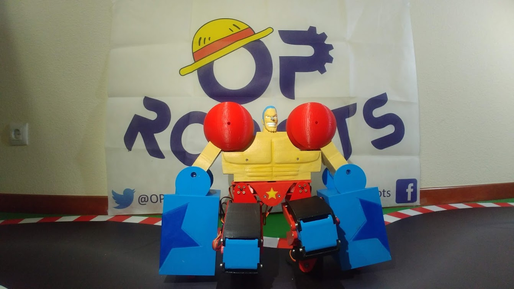
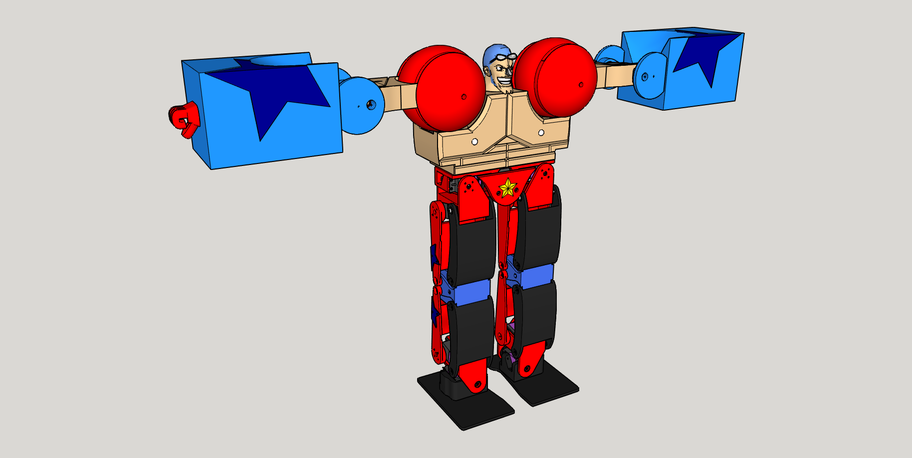

# SuperFrankyBot

Robot humanoide de medio metro de alto, profundamente inspirado en el cyborg Franky del anime OnePiece. Es la versión poderosa de [MiniFrankyBot](https://github.com/OPRobots/MiniFrankyBot) y usa su mismo mando para controlarse

## Hardware
- Arduino Nano
- Controlador de Servos PCA9685
- 15x Servos JX CLS6027 27kg
- Módulo bluetooth HC-05
- LiPo 2S ~2000 mAh
- 2x Leds RGB
- 2x Altavoces
- Lector SD para los audios
- Rodamientos en las articulaciones
- Esqueleto completamente impreso en PLA

## Software
- Programado con Arduino IDE
- El programa tiene acciones básicas como golpeo lateral y frontal, posición de defensa y rotación del tronco y, más importante, POSE SUUUUUUPEEERRRR!

## Librerías
- [Octosnake](https://github.com/JavierIH/octosnake) para el control de servos
- [Adafruit PCA9685 PWM Servo Driver Library](https://github.com/adafruit/Adafruit-PWM-Servo-Driver-Library) para el control de la placa de expansión de servos
- [Madgwick Library](https://github.com/arduino-libraries/MadgwickAHRS) porque en algún momento tuvo algún tipo de IMU (???)
- Wtv020sd16p para la lectura de ficheros de audio (no podemos indicar la fuente original de la librería que estamos usando al haber perdido su referencia; si la recuperamos actualizaremos el README en consecuencia)